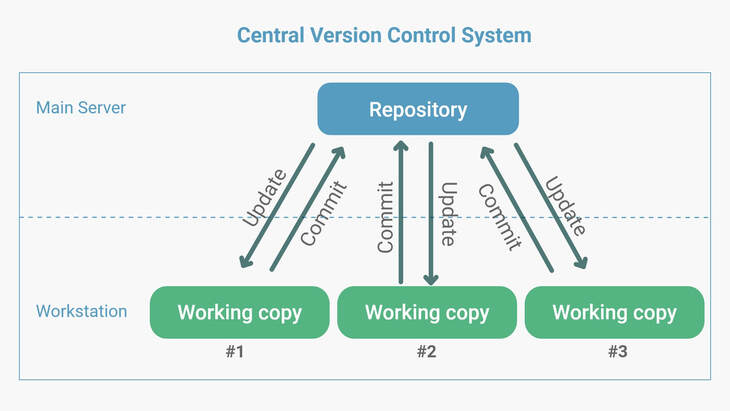
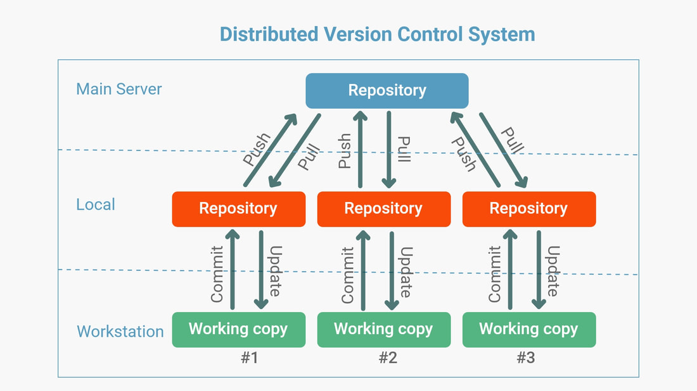

# Version Control System

##  What is version control system?

A version control system is a tool that helps a software developer track and save code changes.

## Types of Version Control Systems

###  Local version control system

In a local version control system you have a so-called version database on your computer. This version database stores different versions of your source code. From that version database, you can get a file for a specific version. This is also known as a checkout. 

``` markdown
Note: Local version control system is powerful to track your code changes locally. And it does not support working
together with other developers on the same code base.
```

###  Centralized version control system

In short, a centralized version control system offers software development teams a way to collaborate using a central server.

It means that, in a centralized version control system, there is also a version database. But here the version database is not stored on your computer. Instead, it is located on a central server. This central server is the reason why it is called a centralized version control system.

But as you can see, on your computer, you have only a specific version. <ins>*To look for example at the history of your source code, or to save changes to your source code, you need a connection to the server.*</ins> This means without the server, you cannot use the features of the version database.

``` markdown
*Translation of the underlined sentence*
আপনার সোর্স কোডের ইতিহাস দেখার জন্য বা আপনার সোর্স কোডে পরিবর্তনগুলি সংরক্ষণ করতে আপনার সার্ভারের সাথে একটি সংযোগ প্রয়োজন৷।
এর মানে সার্ভার ছাড়া, আপনি  ভার্সন ডেটাবেসের ফিচার গুলো ব্যবহার করতে পারবেন না।
```



###  Distributed Version Control System

In a distributed version control system you have also a server, but it is not a central server, but instead  a server computer. It is just another computer that has the version database. Now, on the client computers, you don't check out a single version of the source code. Instead of this, you copy the whole version database to your computer. So, you can see, the version database is distributed across multiple computers. This is the reason why it is called a distributed version control system.



``` markdown
Note: To work with other developers both Centralized version control system and Distributed version control system
work.
```
