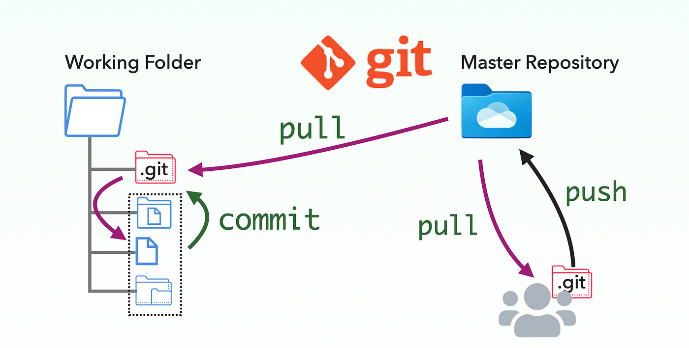

# Git as a Version Control System

`Git is a distributed version control system 📌📌📌`

Git is a version control system that developers use all over the world. It helps you track different versions of your code and collaborate with other developers. In Git, the version database is called a repository. The different versions are identified by commits. A commit means that you saved a change of your source code. When you copy the repository from the server to your computer, it means
in Git terms you clone the repository to your machine.

In this course, you will learn about cloning a repository and about pushing and pulling changes. The server computer
that we will use is GitHub.com. There you can create remote repositories for free. But before working with a remote repository on GitHub.com, you will learn how to work with Git locally on your machine. With Git, you can start with a local repository and you can commit your changes there and learn how to use Git on your machine. At a later stage, you can push your local repository to a remote repository, for example, on GitHub.com. This is actually what we will do in this course.

