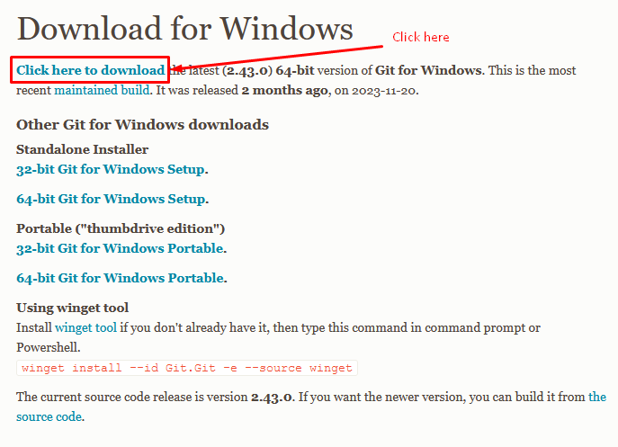

# Git Install & Set Configuration

##  Git ​Download &​ Installation

- To Download Git - [Click Here](https://git-scm.com/download/win)
- Check git version - `git --version`



##  Set Git Configuration (Globally for Local repo)

| Description                                                                                   | Commands                                                                                                         |
| ------------------------------------------------------------------------------------- | -------------------------------------------------------------------------------------------------------------- |
|To set or change user name                                                                      |`git config --global user.name "Sumaya Akter"`                                                                        |
|To set or change user email                                                                      |`git config --global user.email "sumaya55230@gmail.com"`                                                                        |
|To set the git configuration                                                                      |`git config –list`                                                                        |
|Check user name                                                                     |`git config user.name`                                                 |
|Check user email                                                                      |`git config user.email`                                                                        |

```markdownlint
Note: To set configuration, first we must set the user name and email globally for local repositories.
```
