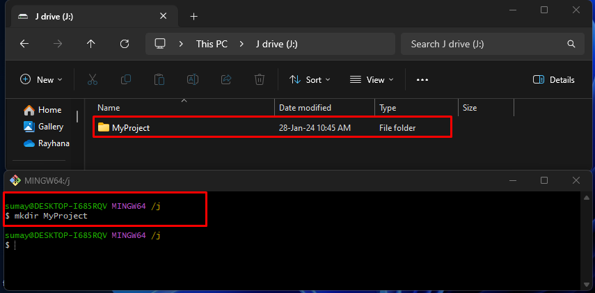

# Create Local Repo

First, open git bash and to create a folder follow the following steps -

``` markdown
1. Create a folder - `mkdir folderName`
2. Go to that created folder - `cd folderName`
3. Initialize the empty git repository - `git init`

The local git repository is created.
```

## For better understanding follow the pictures




