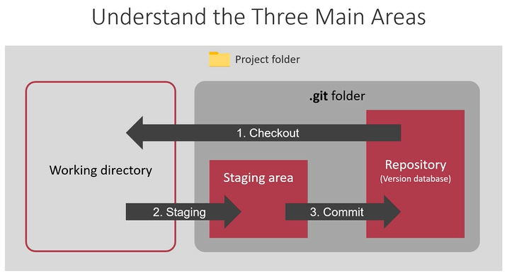

# Three main areas of git repository

1. *Repository* - A folder/project with a .git folder is called a repository.
2. *Working Directory* - The entire interface outside the .git folder is known as the working directory.
3. *Staging area* - When the changes of the working directory are added to the .git folder,
   it is known as the staging area

